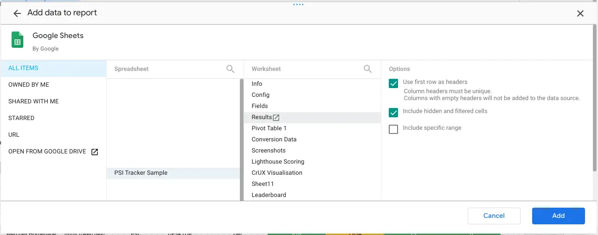

Copyright 2025 Google LLC

Licensed under the Apache License, Version 2.0 (the "License");
you may not use this file except in compliance with the License.
You may obtain a copy of the License at

    https://www.apache.org/licenses/LICENSE-2.0

Unless required by applicable law or agreed to in writing, software
distributed under the License is distributed on an "AS IS" BASIS,
WITHOUT WARRANTIES OR CONDITIONS OF ANY KIND, either express or implied.
See the License for the specific language governing permissions and
limitations under the License.

# Performance PSI Tracker

* [About the Performance PSI Tracker](#about-the-performance-psi-tracker)
* [Setting up the Tracker](#setting-up-the-tracker)
    - [Getting a PSI API Key](#getting-a-psi-api-key)
    - [Configuring the Tracker](#configuring-the-tracker)
* [Using the Performance PSI Tracker](#using-the-performance-psi-tracker)
* [Visualizing your Metrics](#visualizing-your-metrics)
* [Advanced Configuration](#advanced-configuration)

## About the Performance PSI Tracker

The Performance PSI Tracker is a simple, straightforward solution for measuring
and reporting on website performance metrics, focusing on the
[Core Web Vitals](https://web.dev/vitals). The solution uses Google Sheets for
configuration and storing results, so there's no coding or deployment needed to
get started.

All of the metrics are provided by the
[Pagespeed Insights](https://developers.google.com/speed/docs/insights/v5/about)
(PSI) service. PSI runs
[Lighthouse](https://developer.chrome.com/docs/lighthouse/overview/)
on your website for synthetic metrics and fetches data from the
[Chrome User Experience Report](https://developer.chrome.com/docs/crux/) (CrUX)
to provide real user metrics.

## Setting up the Tracker

### Getting a PSI API Key

A prerequisite for using this solution is having an API key for Pagespeed
Insights. Although it will work a few times without an API key, you will quickly
see errors instead of performance data without one.

To get a key:

1. In your browser, open
[https://developers.google.com/speed/docs/insights/v5/get-started](https://developers.google.com/speed/docs/insights/v5/get-started).
1. Under **[Acquiring and using an API key](https://developers.google.com/speed/docs/insights/v5/get-started#APIKey)**,
   click the blue button labeled _Get a Key_.
1. In the dialog that opens, either select an existing Google Cloud project or
   create a new one dedicated to the tracker.

   

1. Agree to the Terms and Conditions, and then click **NEXT** to create the API
   key.
1. Once the key is created, click the **SHOW KEY** button to reveal your API
   key.

   

1. Use the copy icon to copy your API key to the clip board. You can also find
   the key in the [_APIs & Services_ section](https://console.cloud.google.com/apis/credentials)
   of the Google Cloud Console for the project you chose.

> [!IMPORTANT]
> The API key you created can be used for _any_ Google API. It is suggested
> that you restrict the key to specific APIs (namely, Pagespeed Insights and
> CrUX) for better security.

### Configuring the Tracker

The first step to configure the tracker is making a copy of the sheet, which you
can find here &#129046;
[https://docs.google.com/spreadsheets/d/1K3TNRst-8Gi92nws4bybWU6VKpMyNRQ76GROnGPCeOU/edit?usp=sharing](https://docs.google.com/spreadsheets/d/1K3TNRst-8Gi92nws4bybWU6VKpMyNRQ76GROnGPCeOU/edit?usp=sharing)

To make a copy, select the **Make a copy** item from the _File_ menu. The
related App Script file, that the copy dialog warns about, is necessary for the
solution to work.

The steps to configure the tracker are outlined on the _Config_ tab of the
Sheet. More detailed instructions follow:

1. Paste the API key you created before starting into cell B5, below the label
   _API Key for PSI+CrUX_.

   

1. In the cells on the right of the sheet, enter the details of the websites
   you want to track. The columns have the following uses:
   * **Label** - a free-text label to help tell URLs apart. It can also be used
     in reports as a filter.
   * **URL** - the actual URL to track. Be sure to include the `https` or
     `http` at the start.
   * **Device** - the device type to use with Lighthouse and when querying
     CrUX. The options are "Mobile", "Desktop", or "Mobile and Desktop". Using
     any other values will result in the URL not being sent to PSI and the
     status never changing from 🔃.
   * **URL/Origin** - whether to query CrUX for data for the specific URL or
     for the entire origin. The options are "URL" or "Origin". Any other values
     will result in no CrUX data being saved for the URL.
   * **Active** - a checkbox to signal whether the URL should be included in the
     tracking. When adding a new row, be sure to use a checkbox here to ensure
     the value is correctly recognized.
   * **Status** - shows which state the tracker is in with regards to the URL
     in that row. This is updated by the tracker, and doesn't need to be set
     manually.
1. Click the **Authorize script** button. If a pop-up is shown, review the
   permissions being requested and then authorize the app to run on your behalf.
1. Click the **Call PSI API** button to test your configuration. This should
   result in a number of toasts being shown at the bottom right of the sheet,
   with the final toast saying to check the results sheet.

   

1. If the Results sheet is properly populated after clicking the **Call PSI
   API** button, click the **Set PSI daily trigger** button to start daily
   measurement.

   

Following these steps should result in the Results tab being updated daily with
new performance metrics. The rest of the settings on the sheet are for advanced
users and detailed below.

## Using the Performance PSI Tracker

Once everything is set up, the Results tab is populated daily providing a steady
stream of performance data.

The CrUX-related columns in the Results are automatically color coded for you
based on the [official thresholds from web.dev](https://web.dev/vitals/).
Green is good;
Yellow is Needs Improvement;
Red is Poor.

To review the progress of a single page, you can add a data filter to the first
row of the Results tab. Depending on how you have labeled your pages in the
Config, you can either use the URL column or the Label column as the filter. If
you wish to review multiple pages, the page labels are often a better
choice. Please refer to the [Google Sheets documentation on
filtering](https://support.google.com/docs/answer/3540681) for more
information. Using just the color coding, you should be able to see if your
pages are regressing in a significant way.

If you are planning on using the Lighthouse metrics for tracking, we suggest
adding your own conditional formatting to the relevant columns to make it easier
to see how your site is performing. Please see the [Google Sheets documentation
on conditional
formatting](https://support.google.com/docs/answer/78413?hl=en&co=GENIE.Platform%3DDesktop&oco=0)
for more information.

## Visualizing Your Metrics

### Visualizing with Google Sheets

Adding charts directly to the PSI Performance Tracker is an easy option for
getting started with visualization.

Some things to note when creating charts in the Tracker:

* Do not add charts to the config or results tab directly. This can cause the
  tool to stop working until they are removed.
* You cannot plot multiple sites separately using the raw results.
* Copying parts of the results is useful for one-off charts to identify
  historical trends, but not useful for ongoing tracking.

To prepare your data for visualization, the simplest option is to create a pivot
table. If done correctly, it will update automatically every day the
measurements are made. We suggest pulling all of the results into the pivot
table to avoid having multiple versions that may become out of date.

To create the pivot table:

1. From the _Insert_ menu, select _Pivot table_.
1. In the **Data Range** field, enter `Results!A:AI`.
1. Ensure **New Sheet** is selected under _Insert to_.
1. Click **Create**.

   

1. Add the _Date_ field to the Rows section of the Pivot table editor.
1. Add the _Label_ field to the Columns section of the Pivot table editor.
1. Add the metric columns you want to chart to the Values section of the Pivot
   table editor.

   

To create a chart, with a cell of the pivot table selected, select the _Insert >
Chart_ menu item. This will insert a chart with all of the data from the pivot
table. You can then use the Chart editor to edit the chart format and select
only the data you want to visualize.

### Visualizing with Looker Studio

Looker Studio offers a more feature-full method to visualize you data. The
easiest way to get started with Looker Studio is to make a copy of the template
dashboard and then personalize it for your brand and focus metrics. To connect
your data to the template:

1. Open the [Performance PSI Tracker Template
   dashboard](https://lookerstudio.google.com/u/0/reporting/fbc4c1df-3766-417a-8ed3-1a10186e08fa/page/jQ9DD/preview)
1. Click the **Use my own data** button, located at the top-right of the
   template.
1. In the pop-up dialog, select your copy of the PSI Performance Tracker
   spreadsheet.
1. Select the _Results_ Worksheet from the _Worksheet_ list, ensuring the _Use
   first row as headers_ and _Include hidden and filtered fields_ options are
   selected.
1. Click the **Add** button at the bottom-right of the page.

   
   
1. If prompted, confirm you want to add the data to the report by clicking the
   **ADD TO REPORT** button. This may not be shown for users who have selected
   not to see it in the past.

You should see results immediately in the dashboard, however, a week's worth of
data is necessary before any trends are likely to be visible. In general, we've
found that a month's worth of data is the minimum useful amount to be really
useful.

#### Adding Business Data to the Dashboard

If available, the dashboard should include charts that highlight the
relationship between site performance and business metrics. How you add this
data will depend on how you measure business metrics. 

The easiest method is to import the data into a new worksheet in the Performance
PSI Tracker spreadsheet, for example with the [GA4 Reports Builder for Google
Analytics Add-on](https://workspace.google.com/marketplace/app/ga4_reports_builder_for_google_analytics/589269949355/),
and then use [VLOOKUP](https://support.google.com/docs/answer/3093318) or the
[QUERY](https://support.google.com/docs/answer/3093343) function to join the
performance and business data in sheets. You can then add the worksheet with the
joined data to the dashboard as a data source (see the
[documentation](https://support.google.com/looker-studio/answer/6300774) for
more information). 

Another option is to add the business data as a separate data source to the
dashboard and then use a data blend in Looker Studio. Doing this correctly can
require more advanced Looker Studio knowledge. Please see the [documentation on
blends](https://support.google.com/looker-studio/answer/9061420) for more info.

## Advanced Configuration

### Limiting API Calls to Avoid Quota Errors

The Pagespeed Insights (PSI) API has a default quota of 25k queries per day and
240 queries per minute. For most project this is more than enough. However, for
PSI Tracker projects with many URLs, or when the API key is shared among a
number of trackers, you may receive over quota errors instead of results. Large
numbers of URLs being tracked can also lead to the App Script engine timing
out. To avoid these issues, the Config worksheet has three fields you can use
to limit how you use the PSI API.

* **Number of URLs per batch** allows you to limit the number of API calls made
    at one time to avoid going over the queries per minute quota.
* **Run batches of URLs on triggers** sets a timer between test batches to
   ensure the App Script engine does not run to the maximum time for a single
   job.
* **Time between batches** the time in minutes between batches being started, if
   the above parameter is set to true.

### Adding Custom Results Fields

The Fields worksheet (hidden by default) is used to configure the columns
present in the Results worksheet. There are three columns with the following
meanings:

* **Method** Is used to specify which method, or API, is being used to fetch the data. The acceptable values are:
  + _PSI API_ - used with data from the [Pagespeed Insights API](https://developers.google.com/speed/docs/insights/v5/get-started)
  + _CrUX History_ - used with data from the [CrUX History API](https://developer.chrome.com/docs/crux/history-api/)
  + _CrUX_ - used with data from the [CrUX API](https://developer.chrome.com/docs/crux/api/)

> [!IMPORTANT]
> The Method names are case-sensitive. Be sure to enter them correctly.

* **Field** Corresponds to a column header (row A) in the Results
  worksheet. This is where the data will be recorded.
* **Data** This is an App Script expression that will be evaluated, whose return
  value is written to the specified field. The variable `content` is provided
  and contains the parsed JSON object returned by the API specified in the
  Method field. Please see the standard expressions for examples of how to write
  appropriate custom expressions.
